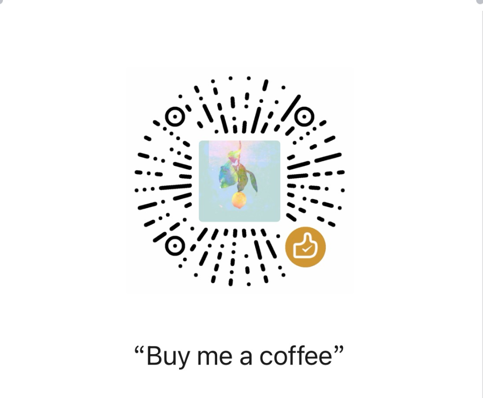

# IChat


IChat is a Chrome side panel extension for context-aware AI chat.
It helps you capture context from the current web page and send it to your selected AI provider without leaving the browser.

## What It Does

- capture selected text or a smart DOM target from the current page, including right-click text capture and visible-area capture for online PDFs
- turn that context into a structured `FlowContext`
- open a native side panel chat for follow-up questions
- support BYOK setup for OpenAI-compatible providers, Gemini, and Anthropic
- render Markdown and math formulas, and search within the current conversation
- dictate into the draft with Chrome built-in recognition, BYOK Alibaba Cloud Fun-ASR-Flash, or MOSS; the selected speech service processes the audio ([setup and data flow](docs/extension-guide.md#voice-input-and-composer))


## Recent Features (September 10–11, 2026)

- **Right-click text capture:** select text on a web page or in Chrome's PDF viewer, then choose **Capture selected text with IChat**. The selection and available source metadata become a `FlowContext`, following your auto-send setting. This path needs no OCR or vision model and does not include surrounding paragraphs.
- **Online PDF capture:** use the extension action or capture shortcut in Chrome's native PDF viewer to attach the currently visible tab area as an image. This requires a vision-capable model and follows your auto-send setting. It captures the viewport, including visible viewer controls, rather than the whole document. Local `file://` PDFs and PDFs embedded in ordinary web pages are not covered by this fallback. [PDF capture guide](docs/extension-guide.md#online-pdfs)
- **Voice input with three speech providers:** choose Chrome built-in recognition, MOSS, or Alibaba Cloud Fun-ASR-Flash in **Settings → STT Provider**, independently of your chat model. Chrome displays words as you speak; MOSS and Fun-ASR transcribe after recording stops, with a three-minute recording limit. An extension permission page and a local microphone level test help troubleshoot microphone access. [Voice setup](docs/extension-guide.md#voice-input-and-composer)
- **Integrated composer and voice-to-send:** text, attachments, microphone, and send/stop controls share a compact composer. Clicking Send while recording stops dictation, waits for transcription, and sends the merged draft once. Stopping with the microphone button only fills the draft; failed or cancelled recognition does not send it. Enter sends, Shift+Enter inserts a line break, and confirming text with an input method does not send.
- **Conversation search:** open search from the chat toolbar or press `Ctrl+F` / `Cmd+F` while focused in IChat. Matches are highlighted with a result count and previous/next navigation; Enter / Shift+Enter moves between matches. Closing search clears active highlights while retaining the search text for reuse in the current conversation.
- **Markdown and math rendering:** messages support GitHub-flavored Markdown, including tables and code blocks, plus inline and display formulas rendered with KaTeX.

Speech audio is processed by the selected speech service. MOSS and Fun-ASR recordings are held in memory and are not persisted by IChat; recognized text is sent to the chat provider when you send the draft. See the [Privacy Policy](docs/privacy-policy.md#5-optional-voice-dictation) for the data flow.

## Install

### Load unpacked in Chrome

1. Run `npm install`
2. Run `npm run build`
3. Open `chrome://extensions/`
4. Enable `Developer mode`
5. Click `Load unpacked`
6. Select `build/chrome-mv3-prod`

## How To Use

1. Open the IChat side panel
2. In `Settings`, add your API key and choose a provider
3. Open an `http` or `https` page, or an online PDF in Chrome's native PDF viewer
4. Trigger capture from the extension action or `Ctrl+Shift+Y` (default shortcut), or select text and right-click **Capture selected text with IChat**. For online PDFs, the action/shortcut captures the visible area as an image; the right-click menu captures selected text.
5. **Auto-send** defaults to off for new installs or when no value is saved; existing saved preferences are preserved. With it off, review the captured context and add your question before sending. With it on, capture starts the send flow immediately.
6. Optionally choose a speech provider in **Settings → STT Provider** and click the microphone to dictate. Click Send during recording to transcribe and send, or click the microphone again to keep the result as a draft.
7. Use the chat toolbar search or `Ctrl+F` / `Cmd+F` to find text in the current conversation.

## Documentation

- [Extension Guide](docs/extension-guide.md)
- [Privacy Policy](docs/privacy-policy.md)
- [Documentation Index](docs/index.md)

## Sponsor

If IChat helps you, tips for the author are welcome.

### WeChat



### Alipay


## Development

```bash
npm install
npm run dev
npm run build
npm run package
npm run typecheck
```

The production extension output is generated under `build/chrome-mv3-prod`.
