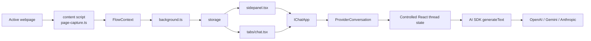

# Architecture

## Overview

IChat is a Plasmo-based Chrome MV3 extension that turns webpage context into a chat-ready `FlowContext`, then routes that context into a native side panel chat experience powered by the AI SDK.

The current implementation focuses on:
- `Plan 1`: selection-first capture
- `Plan 2`: smart DOM capture
- `Bonus 1`: shortcut-triggered capture -> context assembly -> side panel send

## Data Flow

## Main Modules

### [src/contents/page-capture.ts](/E:/Projects/IChat/src/contents/page-capture.ts)

Responsible for in-page capture behavior:
- shortcut-triggered capture entry
- selection-first behavior
- smart DOM targeting when there is no selection
- Apple-Intelligence-style glow highlight
- wheel-to-resize target, left-click confirm, `Esc` cancel

### [src/lib/flow-context.js](/E:/Projects/IChat/src/lib/flow-context.js)

Builds `FlowContext` from the current page.

It provides:
- DOM candidate collection
- text extraction and scoring
- XPath / CSS path generation
- selection-based context building
- smart-DOM-based context building

### [src/background.ts](/E:/Projects/IChat/src/background.ts)

Coordinates extension-level actions:
- listens for the capture shortcut
- opens the side panel in a user gesture
- ensures the content script is injected
- starts capture on the active tab
- receives captured `FlowContext`
- persists app state into storage

### [src/lib/storage.ts](/E:/Projects/IChat/src/lib/storage.ts)

Wraps local extension storage and handles migration/normalization.

It normalizes:
- legacy or partial `FlowContext`
- provider settings and model ids
- API keys
- pending prompt records
- cached chat threads

This keeps the side panel from crashing when older stored data is present.

### [src/lib/prompt-builder.ts](/E:/Projects/IChat/src/lib/prompt-builder.ts)

Converts `FlowContext` into a provider-ready prompt and defines default models, storage keys, and provider labels.

### [src/lib/chat-agent.ts](/E:/Projects/IChat/src/lib/chat-agent.ts)

Creates provider-specific AI SDK model clients and executes `generateText` directly.

It currently routes to:
- OpenAI via `createOpenAI`
- Gemini via `createGoogleGenerativeAI`
- Anthropic via `createAnthropic`

It also maps raw provider errors into more actionable UI messages.

### [src/components/IChatApp.tsx](/E:/Projects/IChat/src/components/IChatApp.tsx)

Top-level UI shell shared by the side panel and detached tab.

It renders:
- a minimal sticky header with only a gear-shaped Settings trigger
- the primary `ProviderConversation` surface
- a settings drawer that groups provider selection, capture state, `FlowContext` review, prompt actions, keys, models, and auto-send preferences
- a composer attachment row where draft FlowContext appears as an `IChat Ctx` chip when auto-send is off

### [src/components/ProviderConversation.tsx](/E:/Projects/IChat/src/components/ProviderConversation.tsx)

Hosts the conversation experience using a controlled React thread state.

It is responsible for:
- hydrating one thread snapshot from storage when the provider view opens
- keeping the active thread in local UI state while the user is chatting
- routing manual sends and pending FlowContext sends through one pipeline
- rendering draft FlowContext as a composer-top attachment that opens a centered, editable modal instead of a thread-top inline card
- persisting snapshots back to storage after updates
- avoiding live rehydration loops that can reset the visible chat UI

## Storage Keys

The extension currently persists these keys:
- `ichat.flowContext`
- `ichat.settings`
- `ichat.apiKeys`
- `ichat.captureStatus`
- `ichat.dispatchStatus`
- `ichat.pendingPrompt`
- `ichat.chatThreads`

## Provider Notes

### Gemini

Gemini runs through `@ai-sdk/google` using the Google Generative AI API.

Important constraints:
- it expects a Google AI Studio Gemini API key
- the key is sent in the `x-goog-api-key` header
- stable recommendation: `gemini-2.5-flash`
- preview alternative: `gemini-3-flash-preview`
- legacy ids like `gemini-3.0-flash-preview` are migrated in storage

## Current Boundaries

Not implemented yet:
- Plan 3
- Plan 4
- vision fallback for canvas-heavy pages
- server-side key brokering
- partial token streaming

Restricted by Chrome:
- `chrome://` pages
- Chrome Web Store pages
- some internal viewers and privileged surfaces
