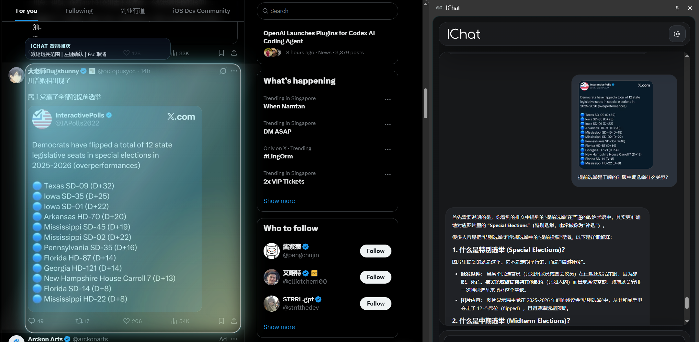
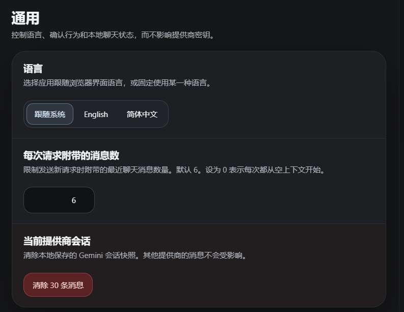
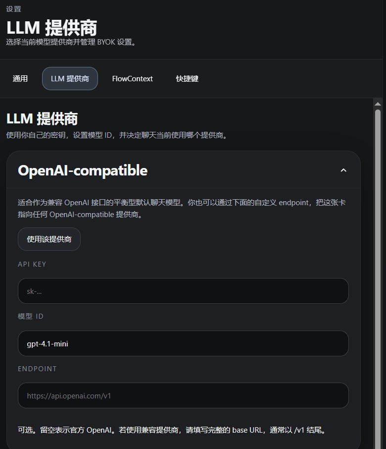
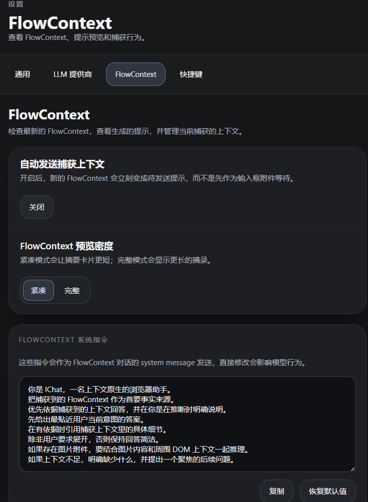

# IChat Extension Guide

Language:
[English](./extension-guide.md) | [简体中文](./extension-guide.zh-CN.md)

## What IChat Does

IChat is a Chrome side panel extension for context-aware AI chat.
Its core idea is intelligent context capture with a seamless Q&A flow, while staying fully local-first so users do not need to route their prompts or API keys through a project-owned backend.

More concretely, IChat watches the region you hover over or the text you select, intelligently builds a context object called `FlowContext`, opens the side panel, and turns the whole context-to-chat handoff into a much smoother experience.

Example scenario:

## Current Capabilities

- selection-first capture
- smart DOM capture when no text is selected
- image-aware attachment handling
- native side panel chat UI
- detached chat tab
- BYOK support for OpenAI-compatible providers, Gemini, and Anthropic

## How To Use IChat

### 1. Load / Install The Extension

For local development:

1. run `npm install`
2. run `npm run build`
3. open `chrome://extensions/`
4. enable Developer mode
5. choose **Load unpacked**
6. select `build/chrome-mv3-prod`

### 2. Open The Side Panel

You can open IChat by:

- clicking the extension action
- using the configured capture shortcut, which defaults to `Ctrl+Shift+Y`

### 3. Settings

#### General

- Supports English and Simplified Chinese, with system-following as the default behavior.
- **Messages sent with each request** controls how many previous messages are attached to a new request. The default value is `6`, which keeps enough recent context for multi-turn conversations while still saving tokens and reducing latency.
- You can clear locally stored conversation history.

#### LLM Providers

Open **Settings** and add one of the following:

- an OpenAI-compatible API key, such as Doubao or another compatible provider
- a Gemini API key from Google AI Studio
- an Anthropic API key

#### FlowContext

- **Auto-send**
  - When auto-send is on, captured context enters the send pipeline immediately without requiring a manual send step.
  - When auto-send is off, you can type your own prompt first and then send it together with the captured context.
- **FlowContext system instructions** act as the system prompt and can be customized.
- **Inspect FlowContext** lets you review the current captured fields and prompt content.

## Local Storage And Data Flow

In the current implementation:

- settings and keys are stored in extension local storage
- FlowContext and chat snapshots are stored locally
- image attachments are stored in IndexedDB
- requests are sent directly to the selected provider

For more detail, see the [Privacy Policy](./privacy-policy.md).

## Permissions Summary

IChat currently needs Chrome extension capabilities related to:

- local storage
- interacting with the active page for capture
- side panel presentation
- content script injection and page scripting needed for capture

## How Capture Works

When you trigger IChat on a normal `http` or `https` page, the extension tries to gather relevant context from the current page.

Capture may include:

- selected text
- smart DOM target text
- surrounding implicit context
- page metadata
- image attachment metadata

If an image target cannot be resolved directly, IChat may use a screenshot-based fallback for the visible target area.
