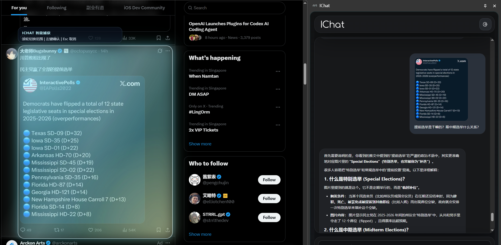
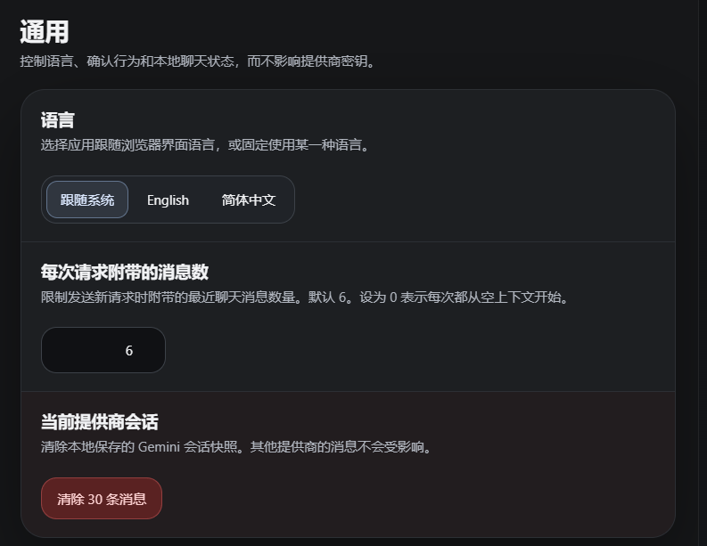
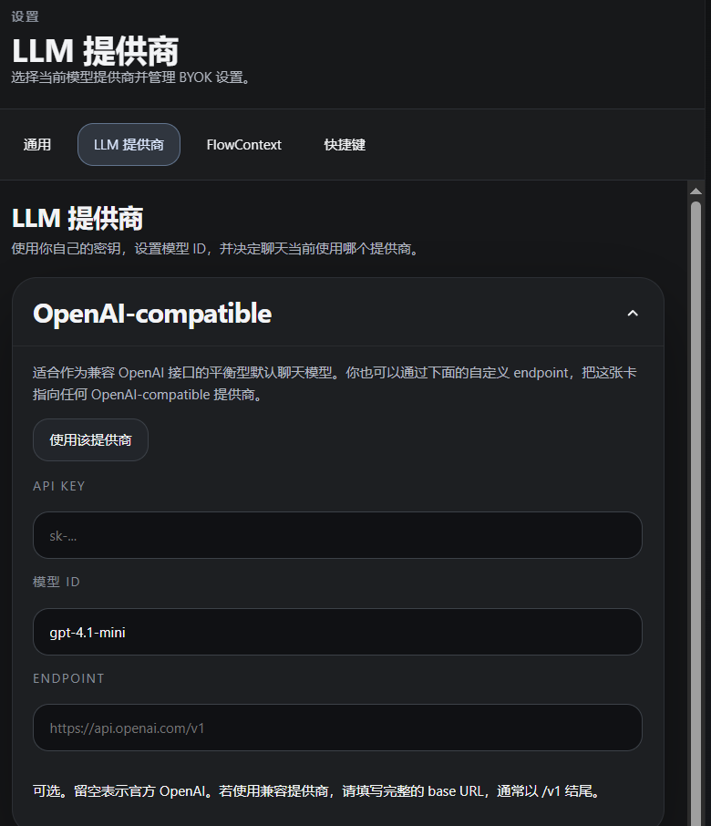
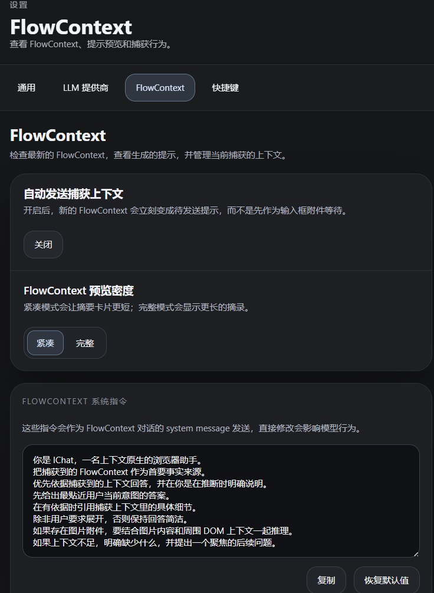

# IChat Extension Guide

Language:
[English](./extension-guide.md) | [简体中文](./extension-guide.zh-CN.md)

## What IChat Does

IChat is a Chrome side panel extension for context-aware AI chat.
Its core idea is intelligent context capture with a seamless Q&A flow, while staying fully local-first so users do not need to route their prompts or API keys through a project-owned backend.

More concretely, IChat watches the region you hover over or the text you select, intelligently builds a context object called `FlowContext`, opens the side panel, and turns the whole context-to-chat handoff into a much smoother experience.

Example scenario:

On ordinary web pages, the shortcut supports two capture paths:

- Selection capture:
  Select the text you care about first, then press `Ctrl+Shift+Y` (the default shortcut) to capture the selected text together with nearby implicit context.
- Smart capture:
  Press `Ctrl+Shift+Y` (the default shortcut) to trigger context capture, and the highlighted target updates as your mouse moves. If the result is not what you want, use the mouse wheel to adjust the capture scope, or press `Esc` to cancel.

## Current Capabilities

- selection-first capture
- smart DOM capture when no text is selected
- image-aware attachment handling
- native side panel chat UI
- detached chat tab
- BYOK support for OpenAI-compatible providers, Gemini, and Anthropic

### Right-click Selected Text

Select text on a web page or in Chrome's PDF viewer, right-click the selection, and choose **Capture selected text with IChat**. IChat opens the side panel and uses the text Chrome supplies as the new FlowContext. Auto-send on sends it through the configured provider flow; auto-send off leaves a draft ready for your question. This path uses plain text, requires no vision model or OCR, and does not touch the clipboard. It captures the selected text and available source metadata only, not surrounding paragraphs. The menu appears only when Chrome provides a text selection and follows IChat's UI language setting.

### Online PDFs

In Chrome's native PDF viewer, use the extension action or capture shortcut to attach the currently visible tab area as an image. A vision-capable model is required. Zoom and scroll to the content you want before capturing; the image can include viewer controls and portions of multiple pages. This captures neither the full document nor the exact text selection. Auto-send follows your existing setting; turn it off in Settings to review the attachment before sending. Local `file://` PDFs and PDFs embedded within ordinary web pages are not covered by this fallback.

## How To Use IChat

### 1. Load / Install The Extension

From GitHub Releases:

1. open the [Releases](https://github.com/robotJie/IChat/releases) page
2. download the latest `ichat-chrome-mv3-prod-<version>.zip`
3. extract the zip to a local folder
4. open `chrome://extensions/`
5. enable Developer mode
6. choose **Load unpacked**
7. select the extracted extension folder

For local development:

1. run `npm install`
2. run `npm run build`
3. open `chrome://extensions/`
4. enable Developer mode
5. choose **Load unpacked**
6. select `build/chrome-mv3-prod`

### 2. Open The Side Panel

You can open IChat by:

- clicking the extension action
- using the configured capture shortcut, which defaults to `Ctrl+Shift+Y`
- selecting text and choosing **Capture selected text with IChat** from the right-click menu

### 3. Settings

#### General

- Supports English and Simplified Chinese, with system-following as the default behavior.
- **Messages sent with each request** controls how many previous messages are attached to a new request. The default value is `6`, which keeps enough recent context for multi-turn conversations while still saving tokens and reducing latency.
- You can clear locally stored conversation history.

#### LLM Providers

Open **Settings** and add one of the following:

- an OpenAI-compatible API key, such as Doubao or another compatible provider
- a Gemini API key from Google AI Studio
- an Anthropic API key

#### FlowContext

- **Auto-send** (off by default for new installs or when no value is saved; existing saved preferences are preserved)
  - When auto-send is on, captured context enters the send pipeline immediately without requiring a manual send step.
  - When auto-send is off, you can type your own prompt first and then send it together with the captured context.
- **FlowContext system instructions** act as the system prompt and can be customized.
- **Inspect FlowContext** lets you review the current captured fields and prompt content.

## Voice Input And Composer

The composer combines the text area and its controls in one panel. The arrow sends the draft; during generation it becomes a square that stops the response. Enter sends, Shift+Enter adds a line break, and confirming text with an input method does not send.

Choose a speech provider in **Settings → STT Provider**, independently of the chat model:

- **Chrome built-in (default):** no key required; words appear as you speak through the browser's speech service.
- **MOSS:** select MOSS and save an API key from `platform.mosi.cn`. Uses `moss-transcribe-1.0` with `POST https://api.mosi.cn/v1/audio/transcriptions`, sending the WAV as a multipart `file` and reading the JSON `text` response. Like Fun-ASR, it records up to three minutes and transcribes after stopping, with a 45-second transcription timeout and cancellation support. MOSS and Fun-ASR keys are saved independently. [MOSS API documentation](https://platform.mosi.cn/docs/reference/transcriptions/).
- **Fun-ASR-Flash:** enter a Beijing-region Bailian API key, enable access to `fun-asr-flash-2026-06-15`, and click **Save API Key**. Click the microphone to record, then click it again (or press Escape in the input) to submit for transcription. This is a non-real-time HTTP model; text appears after recording finishes. At three minutes, recording stops and submits automatically. During transcription, the microphone becomes a cancel button. Startup times out after 15 seconds; transcription times out after 45 seconds.

Chrome and Fun-ASR follow the interface language (English or Simplified Chinese); MOSS detects the spoken language automatically. Text is inserted at the cursor or replaces the selected text, preserving the rest of the draft. Editing is paused during capture/transcription. While recording, clicking Send stops dictation, waits for transcription, and sends the merged draft once. Clicking the microphone to stop only fills the draft. Failed, cancelled, or timed-out recognition does not send the draft; leaving the chat or opening Settings cancels a pending send. Existing installs keep Chrome as the default; changing the speech provider preserves chat settings and keys.

If microphone access is denied or the side panel cannot display a permission prompt, click **Allow microphone** in the error message. Grant access in the extension tab, return to the chat, and click the microphone again. Unsupported browsers, device failures, and unavailable speech services show an error while keeping the draft available for typing.

Microphone permission belongs to IChat's extension origin, not each website beside the side panel. If no speech is recognized, click **Test microphone** in the error message. The extension tab can run a local test for up to ten seconds, showing the default input device and a sound level meter. It does not record or upload audio. A moving meter confirms input signal, not necessarily intelligible speech. If it stays still, check the default microphone at `chrome://settings/content/microphone`, the device mute switch, and the Windows input volume. Stopping the test or leaving the tab releases the microphone.

The selected speech provider processes audio independently of the chat model: the browser's speech service for Chrome, Alibaba Cloud for Fun-ASR-Flash, or MOSS for MOSS transcription. Fun-ASR and MOSS recordings stay only in memory until processing ends or is cancelled; they are sent directly as WAV audio over HTTPS. IChat does not persist recordings. Closing or leaving the chat stops capture and cancels transcription; listening never restarts automatically. You can revoke microphone access in Chrome or system settings. To remove a speech provider key, select that provider and clear its field and click **Save API Key**.

## Local Storage And Data Flow

In the current implementation:

- settings and keys are stored in extension local storage
- FlowContext and chat snapshots are stored locally
- image attachments are stored in IndexedDB
- requests are sent directly to the selected provider
- optional voice dictation sends audio to the selected speech service; recognized draft text is sent to the chat provider only when you send it

For more detail, see the [Privacy Policy](./privacy-policy.md).

## Permissions Summary

IChat currently needs Chrome extension capabilities related to:

- local storage
- interacting with the active page for capture
- side panel presentation
- content script injection and page scripting needed for capture
- `contextMenus` for the explicit selected-text capture menu, including PDF selections

## How Capture Works

When you trigger IChat on a normal `http` or `https` page, the extension tries to gather relevant context from the current page.

Capture may include:

- selected text
- smart DOM target text
- surrounding implicit context
- page metadata
- image attachment metadata

If an image target cannot be resolved directly, IChat may use a screenshot-based fallback for the visible target area.
